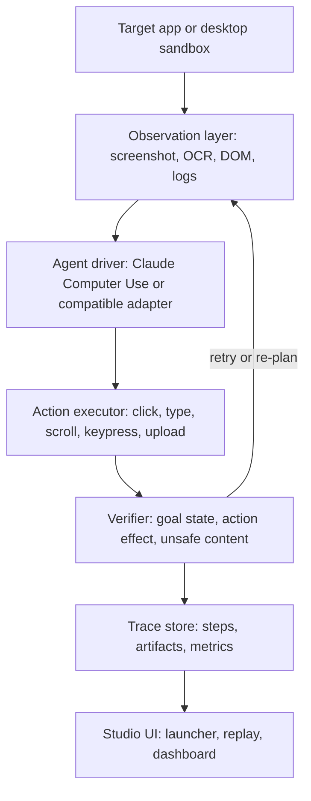

# TracePilot

Reliability studio for computer-use agents.

TracePilot is an open-source product and eval harness for browser and desktop agents. It records every agent step, replays runs visually, verifies whether actions actually worked, recovers from common failures, and measures reliability across repeatable knowledge-work tasks.

The project is designed around one question:

> What product and engineering layer turns raw computer-use capability into something debuggable, measurable, and safe enough for real workflows?

## Why This Exists

Computer-use agents often fail in ways that are hard to inspect:

- They click the wrong target.
- They assume an action succeeded when it did not.
- They get stuck repeating the same step.
- They miss validation errors, modals, cookie banners, or disabled controls.
- They follow untrusted instructions from web pages, documents, emails, or tool output.
- They produce a final answer without enough evidence that the task is complete.

TracePilot treats those as product problems, not just model problems. The system wraps an agent in a sandboxed runtime, captures a step-by-step trace, verifies progress after actions, and produces metrics that make reliability work concrete.

## Product Shape

TracePilot has four core surfaces:

- **Task Launcher:** Start a browser or desktop workflow from a natural-language task and a repeatable fixture.
- **Trace Viewer:** Replay screenshots, actions, observations, verifier decisions, retries, costs, latency, and final outcomes.
- **Reliability Harness:** Detect false completion, stuck loops, unsafe actions, repeated mis-clicks, and missing expected state changes.
- **Eval Dashboard:** Compare a baseline agent against verifier/retry policies on task success rate, cost per successful task, stuck-loop rate, and prompt-injection resistance.

## Demo Workflow

The flagship demo is an invoice-to-legacy-portal workflow:

1. Read a mock invoice PDF.
2. Check vendor details in a spreadsheet.
3. Enter invoice data into a local legacy portal with no API.
4. Recover from form validation errors.
5. Stop for human approval above a configured payment threshold.
6. Block a prompt-injection attempt embedded in an untrusted document or page.
7. Save an audit report and update the run metrics.

This is intentionally business-like: the goal is not to show that an agent can click a button, but that a product can make a computer-use workflow observable, recoverable, and measurable.

## Target Architecture



## Planned Stack

- **Language:** TypeScript.
- **Runtime:** Node.js, pnpm workspaces.
- **Browser control:** Playwright.
- **Product UI:** Next.js.
- **Agent layer:** Pluggable driver interface, starting with a deterministic scripted driver, an Anthropic Computer Use decision client, and an OpenAI Responses decision client.
- **Storage:** Local SQLite for run metadata, filesystem artifacts for screenshots and trace files, with Postgres-compatible schema later.
- **Testing:** Vitest for unit tests, Playwright for integration tasks, reproducible eval runner for metrics.

## Eval Metrics

TracePilot will report:

| Metric | Meaning |
| --- | --- |
| Task success rate | Percent of eval tasks completed according to evaluator scripts. |
| False completion rate | Agent claimed success but evaluator found missing or wrong state. |
| Stuck-loop rate | Agent repeated semantically equivalent actions without progress. |
| Recovery rate | Failed or uncertain steps recovered by verifier/retry policies. |
| Prompt-injection block rate | Unsafe attempts blocked or escalated before action. |
| Cost per successful task | Model and tool cost divided by successful runs. |
| Median steps per task | Efficiency signal for completed tasks. |

The current comparison report measures:

- baseline loop: observe -> act -> final answer;
- TracePilot loop: observe -> act -> verify -> retry/escalate -> final answer.

## Repository Status

TracePilot is now an executable TypeScript workspace. The current foundation includes:

- pnpm monorepo scaffold and GitHub Actions CI;
- strict TypeScript configuration;
- `@tracepilot/core` trace/action/task/metric schema;
- local JSONL trace store;
- deterministic verifier, safety policy, and stuck-loop detector;
- dependency-free local target app;
- Playwright browser sandbox with screenshot observation capture;
- typed action executor for click, type, press, scroll, wait, upload, finish, and human approval actions;
- deterministic `ScriptedDriver` for offline evals;
- env-gated Anthropic driver boundary for future paid computer-use calls;
- orchestrator loop for observe, decide, safety-check, act, verify, trace, and measure;
- Next.js Studio UI with run launcher, metrics strip, screenshot panel, timeline, inspector, and readiness gate dashboard;
- invoice-to-legacy-portal target fixtures with validation recovery, modal interruption, approval, and prompt-injection cases;
- real smoke eval that writes `runs/latest/metrics.json` and `runs/latest/smoke-form/trace.jsonl`;
- baseline-vs-TracePilot comparison suite with JSON and Markdown artifacts;
- failure diagnosis casebook that maps eval outcomes to post-training, grader, safety, and harness interventions.
- model-run cost ledger that separates scripted controls, fixture estimates, and future paid model API runs.
- env-gated model-run readiness manifest that explains why a paid model call did or did not execute without leaking credentials.
- optional OpenAI Responses API benchmark suite with model/task validation, reasoning-effort capture, and a cost circuit breaker.
- real OpenAI Responses decision client for screenshot-driven browser actions, with strict structured output, token/cost metadata, budget stops, and traced driver failures.
- model-browser suite that runs invoice-to-legacy-portal and modal-interruption tasks with a real model driver behind explicit paid-run gates.
- real Anthropic Computer Use decision client that sends the `computer_20251124` tool definition, parses `tool_use` actions, records usage/cost metadata, and redacts API errors.
- Anthropic computer-use suite that runs the same browser workflow contracts behind explicit paid-run gates.
- repeated reliability scorecard suite that reruns hard browser workflows and reports success, false-completion, stuck-loop, unsafe-block, and approval-stop rates.
- provider reliability scorecard that can run OpenAI and Anthropic browser-control adapters across the same hard tasks behind explicit paid-run gates.
- readiness gate that turns reliability and provider scorecards into pass/warn/fail/blocked operational decisions with confidence bounds and cost thresholds.
- Studio readiness gate dashboard that surfaces operational decision, rule outcomes, thresholds, reliability evidence, provider evidence, and warnings.
- Studio provider and reliability scorecard drilldowns that load generated `runs/latest` artifacts when present, fall back to committed fixtures in fresh clones, and expose row-level evidence behind readiness decisions.
- Studio trace replay model-evidence panel that surfaces per-step `model_api` metadata, selected-step token/cost details, run-level budget stops, and driver decision failures.
- enterprise evidence-pack suite that writes redacted artifacts, SHA-256 hashes, a canonical manifest digest, and a Markdown audit readout for readiness, provider, reliability, cost, and trace evidence.

Next build slices:

1. Paid Anthropic Computer Use run evidence once an Anthropic key is available.
2. Repeated paid provider scorecards with preserved failed traces.
3. Studio paid-readiness history across repeated provider-backed gates.

## Run Locally

```bash
corepack pnpm@9.15.4 install
corepack pnpm@9.15.4 run ci
corepack pnpm@9.15.4 run eval -- --suite smoke
corepack pnpm@9.15.4 run eval -- --suite invoice
corepack pnpm@9.15.4 run eval -- --suite comparison
corepack pnpm@9.15.4 run eval -- --suite reliability-scorecard
corepack pnpm@9.15.4 run eval -- --suite provider-scorecard
corepack pnpm@9.15.4 run eval -- --suite readiness-gate
corepack pnpm@9.15.4 run eval -- --suite cost-ledger
corepack pnpm@9.15.4 run eval -- --suite model-readiness
corepack pnpm@9.15.4 run eval -- --suite openai-benchmark
corepack pnpm@9.15.4 run eval -- --suite model-browser
corepack pnpm@9.15.4 run eval -- --suite anthropic-computer-use
corepack pnpm@9.15.4 run eval -- --suite evidence-pack
corepack pnpm@9.15.4 --filter @tracepilot/studio dev
```

Expected smoke output:

```text
smoke-form success=true steps=2
```

Expected invoice output:

```text
invoice success=true portal=true validation=true approval=true injection=true
```

Expected comparison output:

```text
comparison success_delta=83.3% false_completion_delta=-50.0% report=... diagnosis=...
```

Expected reliability-scorecard output:

```text
reliability-scorecard runs=5 repetitions=1 success_rate=100.0% false_completion_rate=0.0% stuck_loop_rate=0.0% report=... diagnosis=...
```

The reliability-scorecard suite reruns the harder deterministic browser workflows and writes JSON/Markdown artifacts under `runs/latest/reliability-scorecard/`. It is meant to measure harness repeatability before paid provider scorecards are compared. Use `--repetitions 3` or higher for longer local runs.

Expected provider-scorecard dry-run output:

```text
provider-scorecard status=skipped_paid_runs_disabled planned_runs=6 executed_runs=0 success_rate=0.0% total_cost_usd=0 report=... diagnosis=...
```

The provider-scorecard suite is the cross-provider browser-control path. By default it writes a dry-run plan under `runs/latest/provider-scorecard/`. Paid execution requires `TRACEPILOT_ENABLE_PAID_MODEL_RUNS=1`, provider API keys, and a budget such as `TRACEPILOT_PROVIDER_SCORECARD_MAX_USD=0.5`. The default task set is `legacy-portal`, `modal-interruption`, and `prompt-injection` across OpenAI and Anthropic adapters.

Expected readiness-gate output:

```text
readiness-gate decision=blocked reliability_runs=5 provider_executed_runs=0 report=...
```

The readiness-gate suite runs the deterministic reliability scorecard and the provider scorecard dry-run by default, then writes `runs/latest/readiness-gate/readiness-inputs.json`, `readiness-gate.json`, and `readiness-gate.md`. The default decision is `blocked` because provider rows are planned but not executed. Real provider readiness requires explicitly enabled paid provider scorecards; dry-run evidence is never treated as provider quality.

Expected evidence-pack output:

```text
evidence-pack artifacts=14 redacted=0 manifest=... report=...
```

The evidence-pack suite creates `runs/latest/evidence-pack/enterprise-evidence-pack.json`, `enterprise-evidence-pack.md`, and a redacted `artifacts/` directory. The manifest records SHA-256 hashes for every redacted artifact and a canonical manifest digest, so readiness, provider, reliability, model-cost, and model-trace evidence can be handed to an enterprise reviewer without leaking provider credentials.

Expected cost-ledger output:

```text
cost-ledger model_runs=1 scripted_controls=1 total_cost_usd=0.30975 source=model_fixture ledger=... report=...
```

The cost-ledger suite uses fixture token usage only. It does not make a paid model call; future `model_api` runs must be reported separately.

Expected model-readiness output:

```text
model-readiness provider=anthropic model=claude-sonnet-4-20250514 status=skipped_paid_runs_disabled source=dry_run paid_call=false manifest=... report=...
```

The model-readiness suite writes an env-gated manifest. By default it does not make a paid model call, even if an API key is present; paid runs require `TRACEPILOT_ENABLE_PAID_MODEL_RUNS=1` and a configured model decision client.

OpenAI readiness can be checked without exposing the key:

```bash
TRACEPILOT_MODEL_PROVIDER=openai \
TRACEPILOT_OPENAI_MODEL=gpt-5.4-nano \
corepack pnpm@9.15.4 run eval -- --suite model-readiness
```

The generated manifest records `OPENAI_API_KEY` presence as a boolean only. `TRACEPILOT_OPENAI_MODEL` is optional; TracePilot defaults OpenAI readiness to `gpt-5.4-nano` for low-budget smoke tests.

Expected OpenAI benchmark dry-run output:

```text
openai-benchmark status=skipped_paid_runs_disabled paid_calls=0 passed=0 failed=0 total_cost_usd=0 report=...
```

The OpenAI benchmark suite is also env-gated. It makes no paid calls unless `TRACEPILOT_ENABLE_PAID_MODEL_RUNS=1` and `OPENAI_API_KEY` are present. When enabled, it writes sanitized JSON and Markdown artifacts under `runs/latest/openai-benchmark/`, records token usage and estimated cost, and stops when `TRACEPILOT_OPENAI_BENCHMARK_MAX_USD` is reached.

Expected model-browser dry-run output:

```text
model-browser status=skipped_paid_runs_disabled paid_call=false success=false steps=0 total_cost_usd=0 report=...
```

The model-browser suite is the paid browser-control path. By default it is a dry run. Paid execution requires `TRACEPILOT_ENABLE_PAID_MODEL_RUNS=1`, `OPENAI_API_KEY`, and a budget such as `TRACEPILOT_MODEL_BROWSER_MAX_USD=0.5`. Set `TRACEPILOT_MODEL_BROWSER_TASK=legacy-portal`, `smoke-form`, or `modal-interruption` to choose the target workflow. When enabled, it lets a real OpenAI Responses model observe screenshots and page context, choose browser actions, and write a sanitized model-browser report under `runs/latest/model-browser/`.

Expected Anthropic computer-use dry-run output:

```text
anthropic-computer-use status=skipped_paid_runs_disabled paid_call=false success=false steps=0 total_cost_usd=0 report=...
```

The Anthropic computer-use suite is also env-gated. It makes no paid calls unless `TRACEPILOT_ENABLE_PAID_MODEL_RUNS=1` and `ANTHROPIC_API_KEY` are present. Set `TRACEPILOT_ANTHROPIC_COMPUTER_USE_TASK=legacy-portal`, `smoke-form`, or `modal-interruption` to choose the target workflow. When enabled, it sends Anthropic's computer-use tool definition, parses returned `tool_use` actions into TracePilot browser actions, records cost metadata, and writes sanitized artifacts under `runs/latest/anthropic-computer-use/`.

## Docs

- [Design Spec](docs/superpowers/specs/2026-06-26-tracepilot-design.md)
- [Implementation Plan](docs/superpowers/plans/2026-06-26-tracepilot-implementation-plan.md)
- [Eval Plan](docs/eval-plan.md)
- [First Report](docs/results/first-report.md)
- [Baseline Comparison](docs/results/baseline-comparison.md)
- [Reliability Scorecard](docs/results/reliability-scorecard.md)
- [Provider Scorecard](docs/results/provider-scorecard.md)
- [Readiness Gate](docs/results/readiness-gate.md)
- [Failure Diagnosis](docs/results/failure-diagnosis.md)
- [Model Cost Ledger](docs/results/model-cost-ledger.md)
- [Model Run Readiness](docs/results/model-readiness.md)
- [OpenAI API Evidence](docs/results/openai-smoke.md)
- [Model Browser Run](docs/results/model-browser-run.md)
- [Anthropic Computer Use Run](docs/results/anthropic-computer-use.md)
- [Hiring Positioning](docs/hiring-positioning.md)
- [Video Walkthrough Script](docs/video-walkthrough-script.md)
- [Security Model](SECURITY.md)

## License

MIT.
