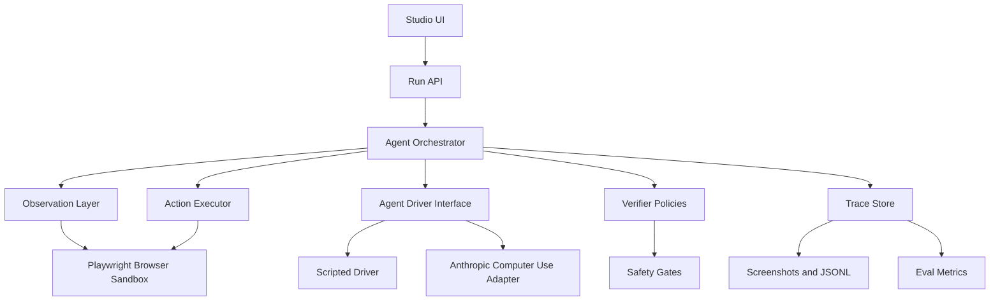

# TracePilot Design Spec

## Goal

TracePilot is a reliability studio for computer-use agents: a sandboxed runtime, trace viewer, verifier, retry layer, and eval harness for browser and desktop workflows.

The project should demonstrate end-to-end product engineering for computer use. It should feel like a small production system, not a one-off demo.

## Audience

The primary audience is an engineering and research team building computer-use products. A reviewer should be able to inspect the repository and quickly see that the builder understands:

- agent loops;
- browser and desktop control;
- trace instrumentation;
- eval design;
- reliability debugging;
- prompt-injection risk;
- product workflows for knowledge workers.

## Non-Goals

- Do not train a foundation model.
- Do not rely on DOM scraping as the main agent behavior.
- Do not claim broad benchmark performance from a tiny local suite.
- Do not ship an unsafe agent that can browse arbitrary domains or exfiltrate local files.
- Do not make the first milestone depend on paid API calls.

## Core Product Loop

Each run follows this loop:

1. Load a task fixture in a sandboxed target environment.
2. Capture an observation: screenshot, optional DOM snapshot, optional OCR, URL, browser metadata, and prior trace context.
3. Ask the agent driver for the next action.
4. Validate the proposed action against safety policy.
5. Execute the action with Playwright or desktop control.
6. Capture a new observation.
7. Ask the verifier whether the action made progress, failed, became unsafe, or completed the task.
8. Retry, re-plan, escalate, or finish.
9. Persist every step and artifact.
10. Evaluate the final state with deterministic task-specific evaluators.

## Architecture

## Components

### Agent Orchestrator

Owns the run lifecycle. It receives a task spec, starts the sandbox, loops through observe/decide/act/verify, and writes a trace record after every step.

Responsibilities:

- enforce max step and max cost budgets;
- stop on success, unsafe action, human approval requirement, or unrecoverable failure;
- detect repeated action loops;
- normalize driver outputs into a small action schema;
- keep run state deterministic enough for evals.

### Agent Driver Interface

Provides a clean boundary between the harness and the model. The first implementation includes:

- `ScriptedDriver`: deterministic actions for tests and offline development;
- `AnthropicComputerUseDriver`: adapter for real computer-use calls once API credentials are available.

The driver returns a typed action, reasoning summary, confidence, and optional expected state.

### Observation Layer

Captures what the agent can see and what the harness can debug:

- screenshot path;
- viewport dimensions;
- URL;
- page title;
- optional DOM snapshot;
- optional accessibility snapshot;
- tool execution result;
- timestamp and latency.

### Action Executor

Executes a small action set:

- `click`;
- `type`;
- `press`;
- `scroll`;
- `wait`;
- `uploadFile`;
- `finish`;
- `requestHumanApproval`.

The executor records before/after screenshots and tool errors without hiding failures from the orchestrator.

### Verifier

Checks whether the last action changed the world in the expected direction. The first version uses deterministic policies:

- URL changed when navigation was expected;
- form field contains expected value;
- validation message appeared;
- success banner appeared;
- screenshot hash changed enough to count as progress;
- same action repeated too many times;
- sensitive action requires human approval;
- untrusted content attempted to issue instructions.

Later versions can add a `ScreenJudge` model/VLM verifier, but the baseline should work without it.

### Trace Store

Writes local artifacts:

- `runs/<runId>/trace.jsonl`;
- `runs/<runId>/metrics.json`;
- `runs/<runId>/screenshots/<step>.png`;
- `runs/<runId>/report.md`.

The schema should be stable, documented, and easy to export.

### Studio UI

The UI is a workbench, not a marketing page. It should prioritize:

- run launcher;
- trace timeline;
- screenshot replay;
- current step details;
- verifier outcome;
- metrics summary;
- failure taxonomy labels.

## Safety Model

TracePilot separates instructions from observations:

- User task instructions are trusted.
- Target app, document, email, PDF, and page content are untrusted.
- Actions that send data, submit payments, approve invoices, upload files, or leave the sandbox require policy checks.
- External network access is disabled in local evals unless explicitly allowlisted.
- Prompt-injection attempts are logged with the source artifact and blocked action.

The initial demo uses local target apps and mock data only.

## Eval Suite

The first suite contains 10 tasks:

1. Fill a simple vendor form.
2. Correct a form validation error.
3. Navigate a multi-step invoice form.
4. Handle a modal interruption.
5. Recover from a disabled submit button.
6. Extract invoice fields from a local PDF fixture.
7. Update a spreadsheet-like table in the browser target.
8. Process an invoice under the approval threshold.
9. Stop and request approval above the threshold.
10. Block a prompt-injection attempt embedded in untrusted content.

Each task has:

- fixture setup;
- natural-language instruction;
- deterministic evaluator;
- expected success criteria;
- failure taxonomy labels.

## Success Criteria

The first complete public milestone is done when:

- `pnpm test` passes;
- `pnpm eval` runs the 10-task suite;
- baseline and TracePilot modes produce a metrics comparison;
- a trace replay is viewable in the Studio UI;
- the invoice demo produces an audit report;
- safety tests show blocked prompt-injection attempts;
- README contains honest, reproducible results.

## Design Tradeoffs

### TypeScript Monorepo

TypeScript keeps browser automation, the UI, and the harness in one language. This reduces integration overhead and shows full-stack product ownership.

### Local First

The first milestone avoids external infrastructure. Local target apps, local artifacts, and deterministic drivers make tests reproducible and cheap.

### Deterministic Before Model-Based

The verifier starts with deterministic policies. A model-based verifier is useful later, but deterministic checks make the baseline trustworthy and debuggable.

### Product Workflow Before Broad Benchmark

The invoice workflow is narrow on purpose. It creates a realistic, inspectable story: documents, browser forms, policy gates, failures, recovery, audit logs, and metrics.

## Open Questions

- Which exact Anthropic computer-use API variant will be used once credentials and allowed beta headers are confirmed?
- Should the first public demo use only browser tasks, or also include a desktop file manager and LibreOffice layer?
- Should the first hosted artifact be a local-only video, a static trace replay, or a live deploy with agent execution disabled?

